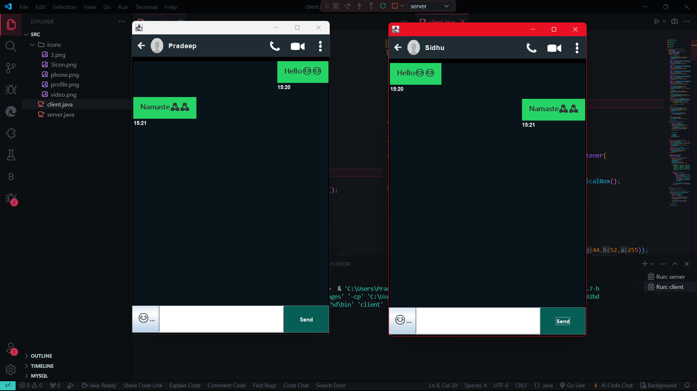

<h1 align="center" style="font-size:35px">Java Chat Application💻</h1>
<br>
<p style="font-size:17px">This is a simple chat application server built using Java Swing for the GUI and Java Sockets for the network communication. The server listens for incoming connections, displays messages, and allows sending messages with emoji support.</p>
<br>
<hr>
<br>
<h2 style="font-size:25px">📖Features</h2>
<ul style="font-size:17px">
<li>Graphical User Interface (GUI)</li>
<li>Emoji Picker</li>
<li>Message Display</li>
<li>Network Communication</li>
</ul>
<hr>
<br>
<h2 style="font-size:25px">⌨️Execution</h2>
<ol style="font-size:18px">
<li>
Prerequisites

<br>

<ul style="font-size:17px">
<li>Ensure Java Development Kit(JDK) is Installed.</li>
<li>An IDE or text editor for Java development (e.g., IntelliJ IDEA, Eclipse, or VS Code).</li>
</ul>
</li>
<br>
<li>Download or Clone the Repository.</li>
<br>

```bash
git clone https://github.com/pvarma-05/Java-Chat-Application.git
cd Java-Chat-Application
```
<li>Run the Code</li>
<br>
<ul>
<li>After Downloading,Open the project folder in VS Code, and Navigate to src folder. It should look like 👇🏻</li>
<br>


<br>

<li>click on run java as shown below for both server.java & client.java</li>

<br>


<br>

<li>Make sure to run server.java first and then run client.java</li>

<br>

</ul>
</li>
</ol>
<hr>
<br>
<h2 style="font-size:25px">📺Output</h2>

<br>

 

<br>
<hr>
<br>
<h2 style="font-size:25px">⭐Contributing</h2>
<br>
<p style="font-size:17px">Feel free to submit issues or pull requests if you find any bugs or have suggestions for improvements.</p>
<br>
<hr>
<h2 style="font-size:25px">©️ License</h2>
<br>
<p style="font-size:17px">This project is licensed under the MIT License. See the <a rel="noreferrer" href="LICENSE">LICENSE</a> file for details.</p>
<br>
<hr>

<br>
<br>
<br>
<h1 align="center">🌐Happy Coding & Keep Innovating✨</h1>